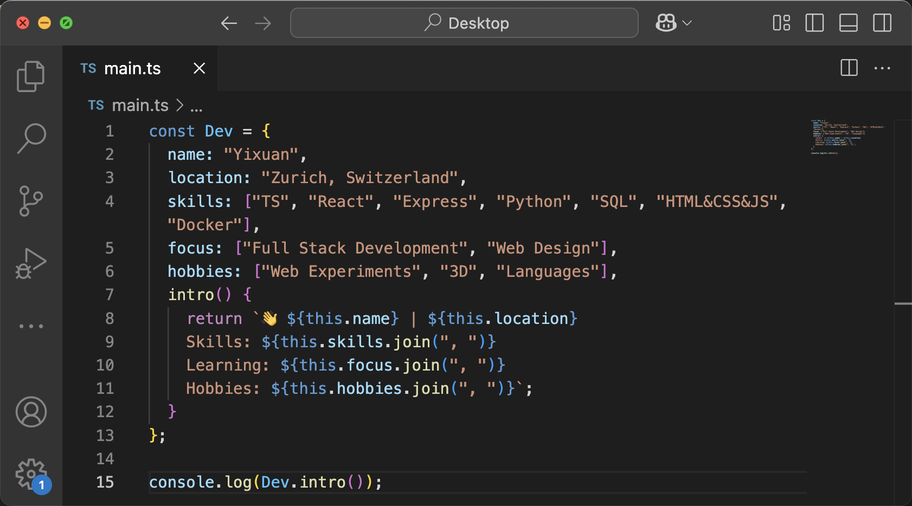

<div align="center">

# Hey there! 



<!-- [](https://github.com/yixuanwu4) [](https://instagram.com/jinnnng4) [](mailto:y@ixuan.com)

```text
 __   __ ___ __  __ _   _   _    _  _ 
 \ \ / /|_ _|\ \/ /| | | | /_\  | \| |
  \ V /  | |  >  < | |_| |/ _ \ | .` |
   |_|  |___|/_/\_\ \___//_/ \_\|_|\_|

 > STORY: Ex-NLP Researcher       
 >         turned Web Artisan 👩🏻‍💻  
 >                                
 > METHOD: 100% Self-Taught       
 >         via docs & projects    
 >                                
 > LOC:    Zürich, Switzerland    
                       
```

### ⚡️ Technologies  


### 🚀 GitHub Stats
<div style="text-align: center; white-space: nowrap;">
  <a href="https://github.com/yixuanwu4" target="_blank" style="display: inline-block; height: 140px; margin-right: 10px;">
    
  </a>
  <a href="https://github.com/yixuanwu4" target="_blank" style="display: inline-block; height: 140px;">
    
  </a>
</div>

<br>
<details>
  <summary><b>🌈 Other Skills 🗂️</b></summary>
  <div align="center" style="margin-top: 10px;">

  #### 🖥️ Languages
  
  
  
  #### 🌐 Web
  
  
  
  #### 🛠️ Tools
  
  
  
  
  #### 🎨 Design
  
  
  
  </div>
</details>
<br> -->


<p align="center">
    
</p>

<p align="center">
  
</p>


</div>